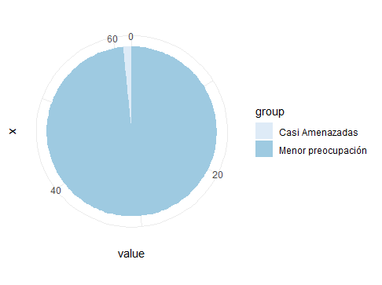
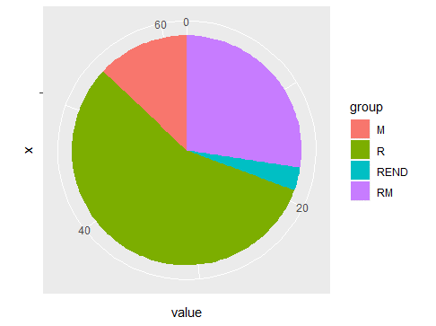
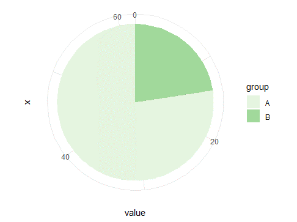
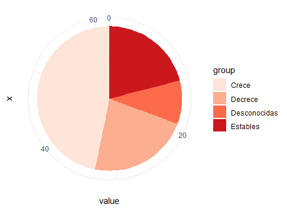

En total se lograron observar 62 especies de aves, siendo los individuos de *Spatula discors*, *Bubulcus ibis* y *Quiscalus mexicanus* los más abundantes en orden decreciente respectivamente. 
\
Según la lista roja de la UICN, Sturnella magna fue la única especie con una clasificación cercanamente amenazada, el resto es de baja preocupación (Fig.3). La mayoría con un estatus de aves residentes (Fig.4)

Tabla.1.Lista de especies observadas en Coris:
**C= **crece **DECRE=** decrece **E=** estable 
**DESC=** desconocida **LC=** menor preocupación **R=**Residente **RM=**Residente o migratorio **REND=**Endémico **M=**Migratorio

   
|	Especie	|	Conteo	|	GA	|	Tendencia 	|	Sitio 	|	Estatus	|
|	----	|	----	|	----	|	----	|	----	|	----	|
|	Dendrocygna autumnalis	|	3	|	LC	|	C	|	A	|	R	|
|	Spatula discors	|	72	|	LC	|	DECRE	|	B	|	M	|
|	Tachybaptus dominicus	|	1	|	LC	|	E	|	B	|	R	|
|	Patagioenas flavirostris	|	12	|	LC	|	DECRE	|	A	|	R	|
|	Columbina inca	|	5	|	LC	|	C	|	A	|	R	|
|	Columbina talpacoti	|	6	|	LC	|	C	|	A	|	R	|
|	Leptotila verreauxi	|	2	|	LC	|	C	|	A	|	RM	|
|	Zenaida asiatica	|	1	|	LC	|	C	|	A	|	RM	|
|	Zenaida macroura	|	3	|	LC	|	C	|	B	|	RM	|
|	Piaya cayana	|	1	|	LC	|	E	|	A	|	R	|
|	Amazilia saucerottei	|	1	|	LC	|	C	|	A	|	R	|
|	Amazilia tzacatl	|	5	|	LC	|	DESC	|	A	|	R	|
|	Gallinula galeata	|	3	|	LC	|	E	|	B	|	RM	|
|	Fulica americana	|	9	|	LC	|	DECRE	|	B	|	RM	|
|	Himantopus mexicanus	|	28	|	LC	|	C	|	B	|	RM	|
|	Vanellus chilensis	|	22	|	LC	|	C	|	B	|	R	|
|	Charadrius vociferus	|	1	|	LC	|	DECRE	|	B	|	RM	|
|	Jacana spinosa	|	13	|	LC	|	DESC	|	B	|	R	|
|	Ardea alba	|	3	|	LC	|	DESC	|	B	|	RM	|
|	Egretta thula	|	2	|	LC	|	C	|	A	|	RM	|
|	Egretta caerulea	|	6	|	LC	|	DECRE	|	A	|	RM	|
|	Bubulcus ibis	|	60	|	LC	|	C	|	A	|	RM	|
|	Butorides virescens	|	3	|	LC	|	DECRE	|	A	|	RM	|
|	Coragyps atratus	|	9	|	LC	|	C	|	A	|	R	|
|	Cathartes aura	|	2	|	LC	|	E	|	A	|	RM	|
|	Elanus leucurus	|	1	|	LC	|	C	|	A	|	R	|
|	Spizaetus tyrannus	|	1	|	LC	|	DECRE	|	A	|	R	|
|	Rupornis magnirostris	|	2	|	LC	|	C	|	A	|	R	|
|	Buteo platypterus	|	1	|	LC	|	C	|	A	|	M	|
|	Buteo brachyurus	|	1	|	LC	|	C	|	A	|	RM	|
|	Momotus lessonii	|	1	|	LC	|	DECRE	|	A	|	R	|
|	Melanerpes hoffmannii	|	6	|	LC	|	C	|	A	|	REND	|
|	Milvago chimachima	|	1	|	LC	|	C	|	A	|	R	|
|	Zimmerius parvus	|	1	|	LC	|	E	|	A	|	R	|
|	Sayornis nigricans	|	4	|	LC	|	C	|	A	|	R	|
|	Pitangus sulphuratus	|	8	|	LC	|	C	|	A	|	R	|
|	Myiozetetes similis	|	6	|	LC	|	E	|	A	|	R	|
|	Tyrannus melancholicus	|	1	|	LC	|	C	|	A	|	R	|
|	Psilorhinus morio	|	7	|	LC	|	C	|	A	|	R	|
|	Pygochelidon cyanoleuca	|	5	|	LC	|	C	|	A	|	RM	|
|	Stelgidopteryx serripennis	|	1	|	LC	|	DECRE	|	A	|	RM	|
|	Troglodytes aedon	|	2	|	LC	|	C	|	A	|	R	|
|	Cantorchilus modestus	|	4	|	LC	|	DESC	|	A	|	R	|
|	Catharus aurantiirostris	|	3	|	LC	|	DESC	|	A	|	R	|
|	Spinus psaltria	|	3	|	LC	|	DECRE	|	A	|	R	|
|	Spinus xanthogastrus	|	2	|	LC	|	DECRE	|	A	|	R	|
|	Zonotrichia capensis	|	24	|	LC	|	E	|	A	|	R	|
|	Melozone cabanisi	|	1	|	LC	|	C	|	A	|	REND	|
|	Sturnella magna	|	8	|	MELA	|	C	|	B	|	R	|
|	Psarocolius montezuma	|	6	|		|	E	|	A	|	R	|
|	Icterus galbula	|	5	|	LC	|	E	|	A	|	M	|
|	Dives dives	|	6	|	LC	|	C	|	A	|	R	|
|	Quiscalus mexicanus	|	46	|	LC	|	E	|	B	|	R	|
|	Parkesia motacilla	|	1	|	LC	|	C	|	A	|	M	|
|	Oreothlypis peregrina	|	4	|	LC	|	DESC	|	A	|	M	|
|	Geothlypis philadelphia	|	1	|	LC	|	DECRE	|	A	|	M	|
|	Setophaga petechia	|	1	|	LC	|	E	|	A	|	RM	|
|	Basileuterus rufifrons	|	2	|	LC	|	E	|	A	|	R	|
|	Cardellina pusilla	|	1	|	LC	|	DECRE	|	A	|	M	|
|	Piranga rubra	|	4	|	LC	|	E	|	A	|	M	|
|	Sporophila morelleti	|	1	|	LC	|	C	|	A	|	R	|
|	Passer domesticus	|	12	|	LC	|	DECRE	|	B	|	R	|

 

 
 

 
 

Fig.3 Grado de amenaza de las especies encontradas. Menor preocupación: 61 especies, Casi amenazadas: 1 especie.

\

 
 

 
Fig.4 Estatus de las especies encontradas. R:35 especies, REND:2 especies, RM:17 especies, M:8 especies
 

 \
 

 Se encontraron mayor número de especies en el sitio A, que en el sitio B (Fig.5). Además según los reportes por la UICN, un 47% de las especies encontradas presentan una tendencia poblacional creciente, un 22% decreciente, un 21% estable y un 10% deficiente de datos o desconocido (Fig.6).

 \

 

 
 
 
 Fig.5 Especies encontradas por sitio de observación. A:48 especies, B:14 especies.
 

\
 
 
 
  

  
 
 Fig.6 Tendencia poblacional de las aves encontradas en general. Crece:47%, Decrece:22%, Estables:21% y Desconocidas:10%.
 

 

 

 
 