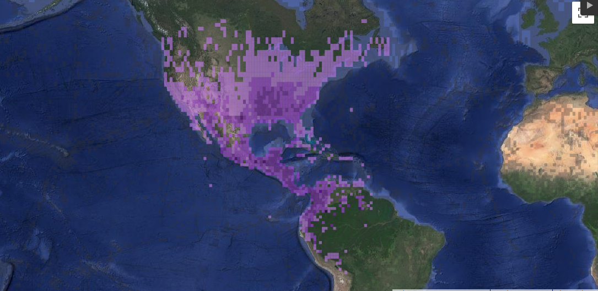
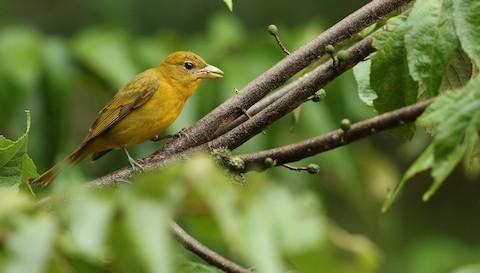
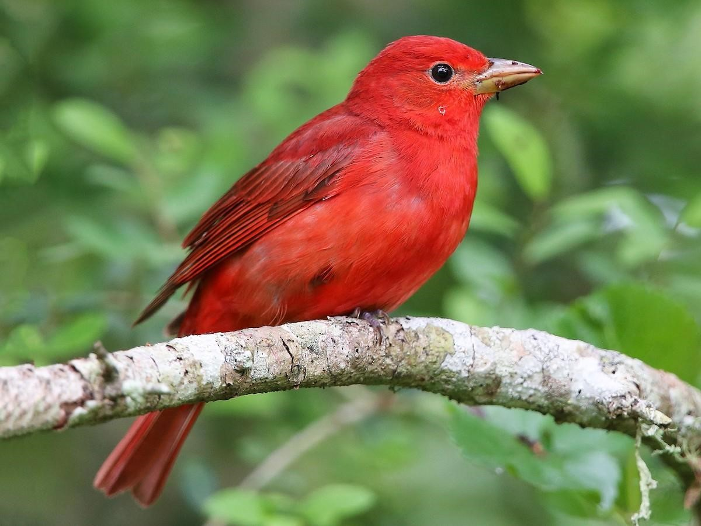

Conocida como Tángara roja migratoria. Es un ave migratoria perteneciente a la familia Cardinalidae.

\
\

**Estado de conservación:**
 

\
\

**Distribución:**
Durante el verano en Norteamérica permanecen en el sur de Estados Unidos y migran hacia América Central y del Sur durante los meses de septiembre hasta abril, durante el invierno(Robinson, 2012).

\

Fig.7Distribución de la tángara roja migratoria (P. rubra). Fuente: eBird.

\

**Características físicas:**
Durante el estadío juvenil los machos y hembras son difíciles de distinguir(Smith, Neal & Mlodinow, 2016). 
Al llegar a la adultez presentan dimorfismo sexual donde los machos son de plumaje rojizo y de pico amarillo, y las hembras son de plumaje verde olivo en el dorso y amarillo ventralmente.

\

**Hábitat:**
*P. rubra* ocupa una gran variedad de hábitats, que van desde bosques caducifolios hasta bosques ribereños en zonas templadas, y en el trópico casi que en cualquier parches boscoso hasta los 2500 m (Shepherd & Burns, 2007).

\
\

 
\
Fig.8 *Piranga rubra* hembra adulta. Autor: Luke Seitz, Fuente: eBird.

\

**Alimentación:**
Se alimenta principalmente de insectos, semillas y frutos(Holden & Burrell, 2015; Smith, Neal & Mlodinow, 2016).
 

\

{width=400px}
\

Fig.5 *Piranga rubra* macho adulto. Autor: Alex Burdo, Fuente:eBird.

