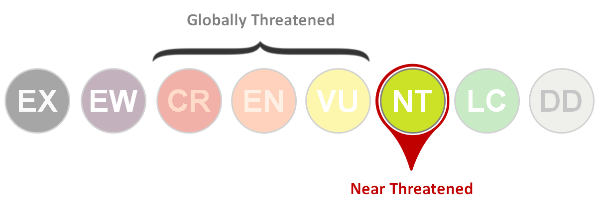
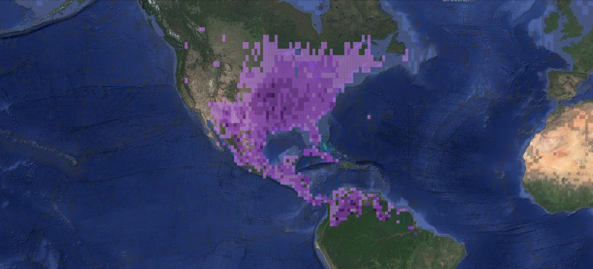
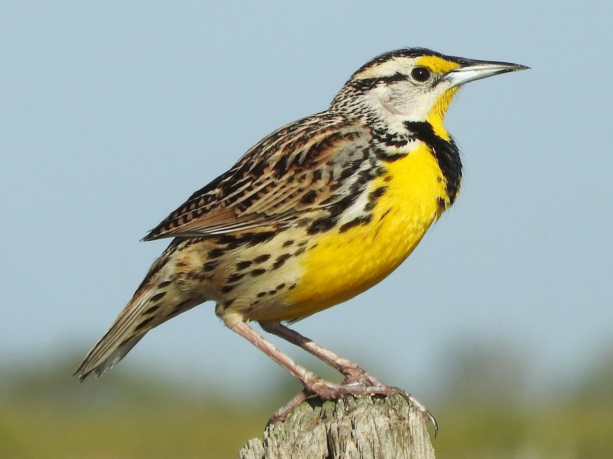

---

Conocido como pradero común o cantor de pradera y pertenece a la familia Icteridae.

**Estado de conservación:**
 

\
\

**Distribución:**
Se encuentra como residente ya que tiene una amplia distribución, pero como la mayoría de aves esta migra hacia el Sur en época de invierno(Dickerman, R. W., & Phillips, A. R. 1970)

\
 

Fig.9  Distribución del pradero común(*S. magna*). Fuente: eBird

**Características físicas:**
Los adultos presentan en  las partes inferiores de color amarillo con una "V" negra en el pecho y con flancos blancos con rayas negras. 
La parte superior es principalmente de color castaño con rayas negras, su  cabeza presenta franjas de delante hacia atrás, alternando el negro con colores claros, como el blanco, amarillento y el castaño claro(Acosta, M., & Mugica, L. 1992).

\

{width=400px}

Fig.10 *Sturnella magna* adulto. Autor: Doris Brookens, Fuente: eBird

\

Los juveniles son más cortos, con un plumaje amarillo menos intenso y una “V” café más claro que en su etapa reproductiva. Una característica interesante en los juveniles de S. magna es que no pueden volar en el momento de abandonar el nido y por ello son vulnerables a los depredadores(Kershner, E. L., Walk, J. W., & Warner, R. E. (2004). . 

\
\

**Hábitat:**
De preferencia buscan zonas abiertas como pastizales y en los bordes de los camino o pantanos(Contreras, 2015).

\

**Alimentación:**
Se alimentan principalmente de artrópodos, también de semillas y bayas(Martinka, 2014)

\

