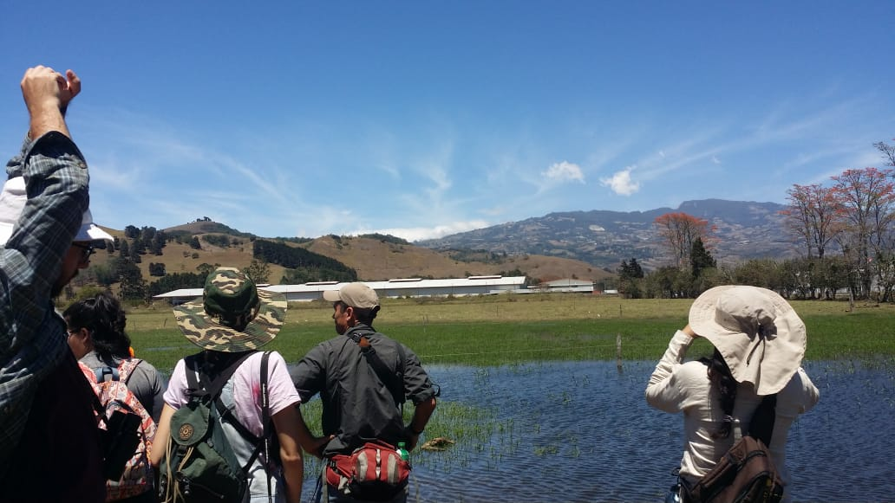
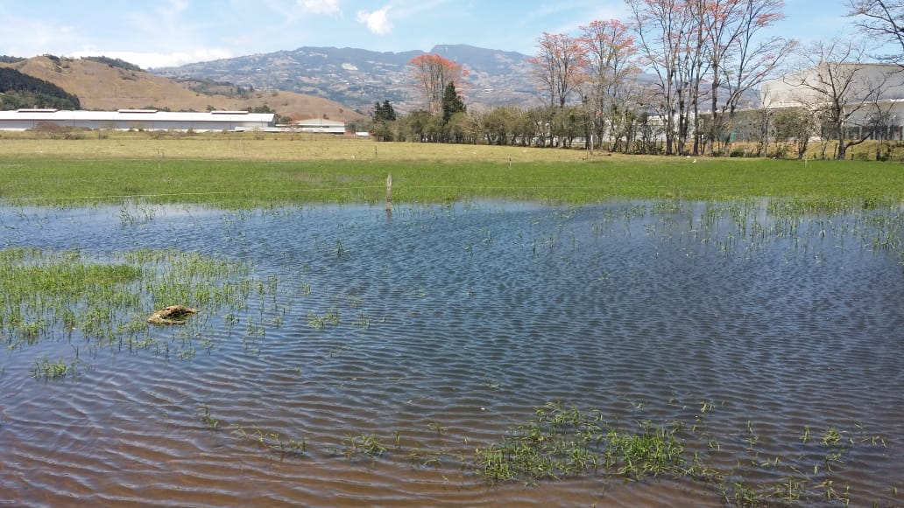

 

 **Autoras:** Jeannina Barrientos Ching y Sofia Pastor Parajeles. 

\
 

 **Descripción de la zona de estudio:**
 \
 Coris se encuentra en la parte central de nuestro país en el cantón El Guarco de Cartago, su relieve es montañoso se encuentra formado por dos cordilleras: la Central y la cordillera de Talamanca. Entre ambos sistemas montañosos se extiende el Altiplano, de clima templado y lluvioso, donde se concentra la mayoria de la población(Inder, 2016).

\
 

La observación de aves se llevó a cabo en 2 puntos con las siguientes características:
\
**A:** Sitio con plantaciones de moras para exportación, cancha de futbol, árboles frutales en su mayoria citricos, rodeada de una zona ganadera con eucaliptos y madero negro.
\
\

**B:** Sitio con 2 lagunas de agua turbia para uso ganadero, la vegetación era escasa cercana a chancheras.

\

 
 
   Fig 1. sector B: Fotografía del Humedal de Coris. Autora: Jeannina Barrientos 

**¿Porque trabajar con aves?**

Las aves son un grupo de gran importancia, estas participan con el flujo de información y materia que se da en los ecosistemas, cumpliendo con funciones de polinización y dispersión de semillas. Esta característica ecológica ayuda a incremento de la diversidad genética en las comunidades de plantas y también a la colonización de nuevos espacios garantizando un crecimiento de la comunidad vegetal y la restauración de los hábitats.
Además, son grupo ideal para generar modelos de bioindicación en los ecosistemas tropicales por lo que estudios de la etología de las aves ayudan a formular planes de manejo y conservación de ecosistemas estratégicos.(Gutiérrez, A, 2003).

\

 
  
   Fig 2. Sector B: Fotografía del humedal de Coris. Autora: Jeannina Barrientos 

